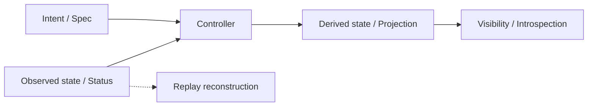
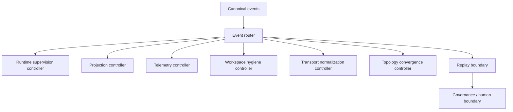
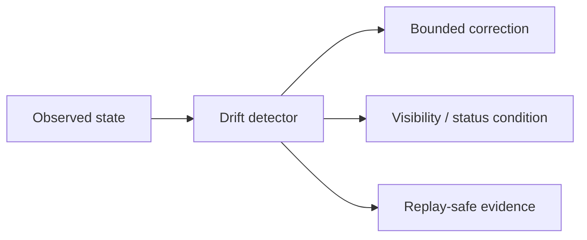

# Operational Control-Plane Audit

This audit identifies which Kubernetes-inspired control-plane principles Rig should adopt, and which Kubernetes-shaped patterns would be cargo cult. The target is a local governed operational runtime substrate, not a cluster orchestrator.

## Doctrine Summary

| Principle | Adopt? | Reason |
|---|---|---|
| Reconciliation | Yes | Rig already has bounded loops for drift correction |
| Controller semantics | Yes | Controllers map cleanly to deterministic operational convergence |
| Drift detection | Yes | Drift is measurable across runtime, topology, telemetry, and replay |
| Spec/status separation | Yes | Reduces ambiguity between desired intent and observed state |
| Condition-based state | Yes | Improves operational visibility without inventing authority |
| Idempotent convergence | Yes | Matches replay-first semantics and retry safety |
| Bounded control loops | Yes | Preserves operational calmness and prevents oscillation |
| Operational introspection | Yes | Needed for stable convergence and failure visibility |
| YAML-centric control | No | Adds ceremony without authority value |
| CRD proliferation | No | Would create fake abstraction layers |
| Fake clusters / distributed theater | No | Rig is local substrate, not orchestration platform |

## Spec vs Status Separation

| Rig Surface | Spec Equivalent | Status Equivalent | Conflated? | Recommended? |
|---|---|---|---|---|
| Runtime supervision | Desired supervision policy, cadence, and bounds | Process health, queue depth, stall state | Partially | Yes |
| Topology cognition | Desired topology layout / visibility policy | Observed node density, lane saturation, routing state | Partially | Yes |
| Telemetry systems | Desired aggregation policy and thresholds | Measured throughput, saturation, memory pressure | Partially | Yes |
| Workspace runtime | Workspace intent, isolation policy, lane identity | Actual workspace lifecycle, namespace state, temp artifacts | Partially | Yes |
| Replay systems | Desired replay scope and integrity rules | Observed replay status, conflicts, findings | Mostly not, but some overlap | Yes |
| Governance state | Human decision intent, gate policy | Approval status, block status, decisions recorded | No, by design | Yes |
| Projection pipelines | Desired render model and refresh rules | Current projection state and staleness | Partially | Yes |
| Transport systems | Desired envelope schema and routing policy | Delivered message shape and sequence state | Partially | Yes |

### Assessment

| Finding | Impact |
|---|---|
| Intent and observed state are already separated in the core substrate | Good foundation for controller adoption |
| Some transport and frontend bridges still mix intent-like hints with observed state | Moderate drift risk |
| Replay already acts as a status-aware reconstruction boundary | Strong fit for spec/status semantics |

## Controller Model Adoption

| Rig Controller Candidate | Single Responsibility? | Replay Safe? | Drift Safe? | Recommended? |
|---|---|---|---|---|
| Runtime supervision | Yes | Yes | Yes | Yes |
| Telemetry reconciliation | Yes | Yes | Yes | Yes |
| Projection reconciliation | Yes | Yes | Yes | Yes |
| Workspace hygiene | Yes, if narrowed to namespace / temp-state cleanup | Yes | Yes | Yes |
| Topology convergence | Yes | Yes | Yes | Yes |
| Transport normalization | Yes, if envelope-first and read-only | Yes | Yes | Yes |
| Replay reconstruction | Yes, but this is a boundary not a loop | Yes | Yes | Boundary only |
| Governance approval | No | Yes | No | No |

### Controller Topology

### Adoption Notes

| Principle | Rig Implication |
|---|---|
| One controller, one responsibility | Prefer narrow controllers over omniscient managers |
| No shared mutable authority | Controllers derive state, they do not own authority |
| Idempotent reconciliation | Re-running must not change authoritative facts |
| Restart safety | Controllers must recover from process restarts without semantic drift |
| Replay safety | Controller outputs must be reconstructable from events |

## Drift-Detection Architecture

| Drift Surface | Detectable? | Correctable? | Replay Safe? | Needs Controller? |
|---|---|---|---|---|
| Topology drift | Yes | Yes | Yes | Yes |
| Replay drift | Yes | Yes, but only by reconstruction | Yes | Boundary controller only |
| Transport drift | Yes | Yes | Yes | Yes |
| Namespace leakage | Yes | Yes | Yes | Yes |
| Projection divergence | Yes | Yes | Yes | Yes |
| Telemetry inconsistency | Yes | Yes | Yes | Yes |
| Operational saturation drift | Yes | Yes | Yes | Yes |

### Drift Detection Map

### Drift Interpretation

| Drift Type | Control-Plane Reading | Response |
|---|---|---|
| Topology drift | Layout or density no longer matches canonical events | Refresh projection / topology controller |
| Replay drift | Reconstruction diverges from recorded events | Treat as replay boundary failure, do not auto-repair |
| Transport drift | Message shape or schema version diverges | Normalize at transport edge |
| Namespace leakage | Workspace partitioning is violated | Reconcile cleanup, isolate, alert |
| Projection divergence | View no longer matches source events | Rebuild projection deterministically |
| Telemetry inconsistency | Synthesis differs from source metrics | Recompute from canonical samples |
| Saturation drift | Queue / memory / cadence unhealthy | Apply bounded throttling and cooling |

## Condition-Based Operational State

| Surface | Conditions Useful? | Why | Risk |
|---|---|---|---|
| Runtime health | Yes | Distinguishes stable, reconciling, saturated, blocked | Low |
| Replay integrity | Yes | Makes replay-unsafe states explicit | Low |
| Topology stability | Yes | Surfaces collapse and density pressure | Medium |
| Workspace isolation | Yes | Makes leakage / degradation visible | Medium |
| Telemetry saturation | Yes | Supports cooling and bounded correction | Medium |
| Transport convergence | Yes | Reveals envelope drift and sequence issues | Medium |
| Reconciliation health | Yes | Shows whether loops are making progress | Low |

### Candidate Conditions

| Condition | Suitable? | Notes |
|---|---|---|
| Stable | Yes | Default healthy state |
| Reconciling | Yes | Active bounded correction |
| DriftDetected | Yes | State diverges from canonical events |
| Saturated | Yes | Loop must cool or throttle |
| ReplayUnsafe | Yes | Reconstruction boundary is compromised |
| TopologyCollapsed | Yes | Visualization or density needs recovery |
| IsolationDegraded | Yes | Namespace partitioning has weakened |
| GovernanceBlocked | Yes | Human boundary is not available or not approved |
| Cooling | Yes | Throttle / backoff state |
| Recovering | Yes | Return to stable after bounded correction |

## Idempotent Reconciliation

| Surface | Idempotent? | Restart Safe? | Event Safe? | Risk Level |
|---|---|---|---|---|
| Runtime reconciliation | Yes | Yes | Yes | Medium |
| Workspace hygiene | Yes | Yes | Yes | Medium |
| Telemetry aggregation | Yes | Yes | Yes | Medium |
| Topology refresh | Yes | Yes | Yes | Medium |
| Projection rebuilding | Yes | Yes | Yes | Low |
| Transport normalization | Yes | Yes | Yes | Medium |

### Idempotence Rules

| Rule | Control-Plane Meaning |
|---|---|
| Same input set, same output | Core reconciliation requirement |
| Retry-safe | Reapplying a controller must not amplify state |
| Duplicate-event safe | Event duplication must not mutate authority |
| Ordering-aware | Deterministic ordering must be preserved |
| Replay-deterministic | Reconciliation must reconstruct identically from history |

## Level-Based vs Edge-Based Logic

| Surface | Edge-Based? | Level-Based? | Drift Risk | Recommended Migration |
|---|---|---|---|---|
| WebSocket events | Yes | Partial | Medium | Use events as hints, status as authoritative observed state |
| Topology updates | Partial | Yes | Low-Medium | Keep level-based reconciliation for density / collapse |
| Replay reconstruction | No | Yes | Low | Keep boundary-based reconstruction |
| Telemetry flows | Yes | Yes | Medium | Derive conditions from sampled state |
| Runtime supervision | Partial | Yes | Medium | Use events to update bounded health state |
| Frontend instrumentation | Yes | Yes | Medium | Refresh projections from canonical envelopes |

### Canonicalization Rule

| Rule | Meaning |
|---|---|
| Events are hints | Events trigger or inform reconciliation |
| State is authoritative | Operational state is derived from the canonical substrate |
| Level-based convergence | Prefer observing current state and correcting it |
| Edge-triggered reactions | Use only as entry points, not as authority |

## Operational Introspection

| Operational Surface | Introspection Present? | Missing Visibility |
|---|---|---|
| Reconciliation visibility | Partial | Loop health, retries, damping, convergence progress |
| Telemetry visibility | Yes | Explicit condition summaries, saturation trend markers |
| Topology visibility | Yes | Drift causes and convergence status |
| Runtime health | Yes | Clear stable/reconciling/saturated state |
| Loop governance | Partial | Cadence, damping, retry ceiling, abort cause |
| Workspace health | Partial | Namespace leakage and cleanup completion |

### Introspection Requirements

| Needed Visibility | Why |
|---|---|
| Convergence progress | Shows whether reconciliation is working |
| Drift conditions | Shows what the loop is correcting |
| Retry storms | Prevents invisible oscillation |
| Saturation conditions | Prevents overloaded loops from masquerading as healthy |
| Cooling state | Makes backoff legible |
| Replay-unsafe state | Prevents hidden corruption |

## Cargo-Cult Risks

| Risk | Present? | Emerging? | Prevention Strategy |
|---|---|---|---|
| YAML explosion | No | Low | Avoid config theater; prefer typed primitives |
| CRD proliferation | No | Low | No schema explosion; keep runtime-local models |
| Fake cluster abstractions | No | Low | Keep Rig local substrate scoped |
| Scheduler cosplay | No | Medium | Use bounded cadences only where needed |
| Distributed systems theater | No | Low | Do not invent cluster semantics |
| Over-generalized controllers | Partial | Medium | Keep controllers narrow and single-purpose |
| Orchestration abstraction bloat | Partial | Medium | Add only if they reduce drift and ambiguity |
| Transport-as-authority | Partial | Medium | Envelope normalization only, never authority from delivery |
| Reconciliation overreach | Partial | Medium | Bound loops and preserve transactional boundaries |
| Infinite reconciliation | No | Medium | Hard caps, damping, retry ceilings, aborts |

### Prevention Rules

| Rule | Effect |
|---|---|
| No YAML worship | Prevents configuration theater |
| No CRD explosion | Prevents fake platform complexity |
| No fake clusters | Preserves local runtime identity |
| No omniscient controllers | Preserves authority boundaries |
| No infinite loops | Preserves operational calmness |
| No transport authority | Preserves replay and governance semantics |

## Authority Boundary Preservation

| Boundary | Keep Explicit? | Why |
|---|---|---|
| Git commits | Yes | Durable transaction with human intent |
| Merge approval | Yes | Human authority must remain explicit |
| Replay finalization | Yes | Forensic state must not be continuously rewritten |
| Artifact publication | Yes | External visibility requires discrete boundary |
| Governance escalation | Yes | Cannot be absorbed into controllers |
| Schema migration | Yes | Controlled boundary with replay implications |

## Replay-Safe Controller Semantics

| Semantics | Required? | Why |
|---|---|---|
| Deterministic input ordering | Yes | Ensures replay-identical behavior |
| Bounded correction window | Yes | Prevents runaway loops |
| Explicit status conditions | Yes | Makes convergence observable |
| Idempotent apply | Yes | Safe retries and restarts |
| No hidden authority mutation | Yes | Preserves governance integrity |
| Replay-aware operation | Yes | Reconstruction must remain valid |

## Control-Plane Convergence Assessment

| Question | Answer |
|---|---|
| Has Rig identified the correct Kubernetes principles to adopt? | Yes |
| Has Rig preserved operational calmness? | Yes |
| Has Rig preserved replay-first semantics? | Yes |
| Has Rig preserved governance boundaries? | Yes |
| Has Rig identified cargo-cult risks? | Yes |
| Has Rig clarified controller semantics? | Yes |
| Has Rig clarified operational authority? | Yes |
| Has Rig clarified drift-detection strategy? | Yes |

## Recommended Safe Adoptions

| Priority | Adoption | Why |
|---|---|---|
| 1 | Spec/status separation | Removes intent vs observed-state ambiguity |
| 2 | Condition-based operational state | Makes convergence legible |
| 3 | Idempotent reconciliation | Enables safe retries and restart recovery |
| 4 | Drift detection | Drives bounded correction |
| 5 | Controller isolation | Prevents authority concentration |
| 6 | Bounded reconciliation | Preserves calmness and prevents oscillation |
| 7 | Operational introspection | Makes control-plane health visible |
| 8 | Level-based reconciliation | Avoids edge-trigger fragility |

## Explicit Rejections

| Rejected Pattern | Reason |
|---|---|
| Cluster simulation | Wrong problem domain |
| Fake distributed orchestration | Adds theater without value |
| CRD explosion | Unnecessary abstraction proliferation |
| YAML-centric architecture | Ceremony without authority |
| Infinite controllers | Instability and ambiguity |
| Transport-authoritative systems | Breaks replay and governance |

## Validation Notes

- `python3.14 -m compileall -q src tests`
- `bash scripts/check.sh --fast`

