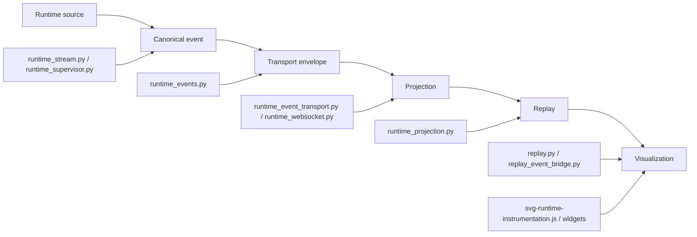
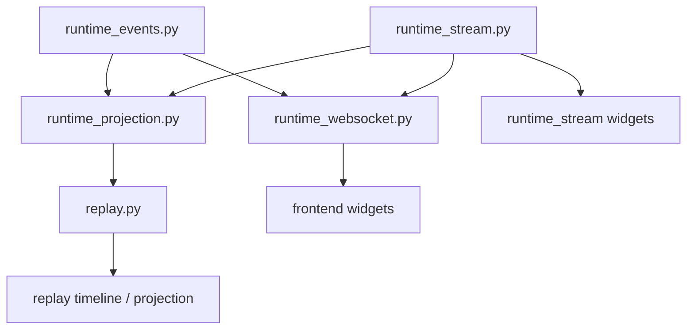
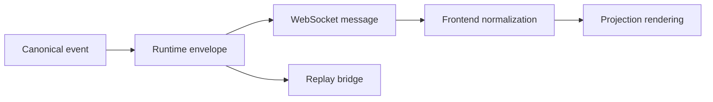
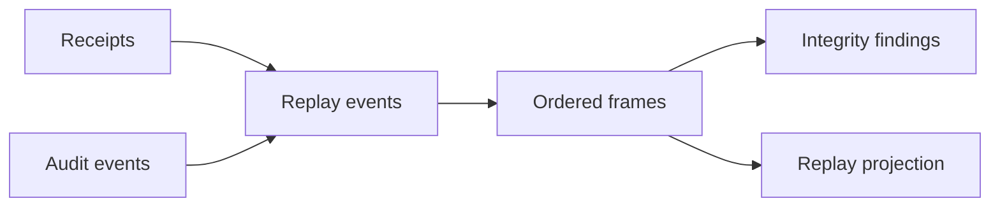
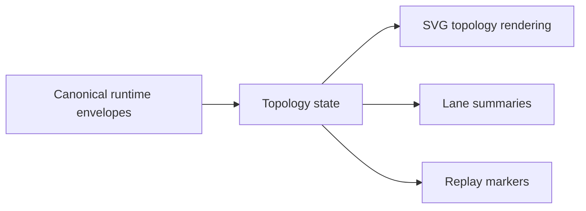

# Runtime Convergence Audit

This audit measures how far Rig's runtime plane has converged onto the canonical operational substrate. It is intentionally conservative: it records current convergence, residual legacy paths, and migration priorities without proposing replacement architecture.

## Scope

- Runtime stream models
- Runtime websocket integration
- Runtime projection flow
- Replay systems
- Topology systems
- Runtime supervision
- Transport pathways
- Instrumentation rendering
- Workspace isolation

## Definitions

| Category | Meaning |
|---|---|
| Fully converged | Canonical substrate authoritative |
| Partially converged | Mixed legacy + substrate |
| Legacy pathway | Bypasses substrate |
| Drift risk | Semantics likely to fragment |
| Critical migration path | Needed before scaling |

## Runtime Event Flow

## Phase 1: Runtime Event Flow Audit

| Runtime Path | Canonical Event? | Bypasses Substrate? | Deterministic Ordering? | Replay Convergence? | Normalized Transport? | Topology Uses Canonical Envelope? |
|---|---|---|---|---|---|---|
| `runtime_events.py` | Yes | No | Yes, via sequence + stable ID | Partial, depends on downstream use | Yes, via event envelope model | Partial |
| `runtime_event_router.py` | Yes | No | Yes, buffer sorted by sequence/timestamp/event_id | Partial, router replays events but does not define replay lineage | N/A | No |
| `runtime_stream.py` | Partially | Yes, legacy stream model is still a separate substrate | Yes in-model, but not the canonical event model | Partial | No | No |
| `runtime_supervisor.py` | Partially | Yes, it still owns process state and buffer logic | Mostly, but supervision records are not uniformly event-native | Partial | No | No |
| `runtime_websocket.py` | Partially | Yes, message model is separate from canonical runtime events | Mostly, but websocket message sequencing is its own layer | Partial | Partial | Partial |
| `runtime_projection.py` | Yes | No | Yes | Yes, projection pipeline is replay-safe in design | Yes, when fed canonical events | Partial |
| `replay.py` | Yes | No | Yes, explicit sort and frame hashes | Yes, core replay substrate | N/A | No |
| `replay_event_bridge.py` | Yes | No | Yes | Yes, bridge is deterministic | N/A | No |
| `svg-runtime-instrumentation.js` | Partial | Yes, normalizes envelopes but also accepts ad hoc inputs | Yes only after normalization | Partial | Partial | Partial |

### Runtime Flow Assessment

| Finding | Assessment |
|---|---|
| Canonical events already exist | Yes |
| Runtime execution is fully routed through canonical events | No |
| Deterministic ordering is established | Yes, but multiple ordering domains still exist |
| Replay convergence is present | Yes, but not yet universal |
| Transport normalization is complete | No |
| Topology consumption is canonical-only | No |

## Phase 2: Projection Convergence

| Projection Surface | Canonical Event Aware? | Replay Safe? | Deterministic? | Needs Migration? |
|---|---|---|---|---|
| `runtime_projection.py` | Yes | Yes | Yes | No |
| `runtime_stream.py` projections | Partial | Partial | Partial | Yes |
| `runtime_websocket.py` message projections | Partial | Partial | Partial | Yes |
| `svg-runtime-instrumentation.js` | Partial | Partial | Yes after normalization | Yes |
| `runtime-stream-card.js` | Partial | Partial | Yes after sorting | Yes |
| `runtime-topology-panel.js` | Partial | Partial | Yes in rendering, not in inputs | Yes |
| `runtime-status-card.js` | Partial | Partial | Yes in rendering, not in inputs | Yes |
| `replay-timeline-card.js` | Yes | Yes | Yes | Low |

### Projection Notes

- `runtime_projection.py` is the strongest convergence point: projections are derived from events and bounded.
- `runtime_stream.py` still behaves like an alternative runtime-local state model instead of a pure event source.
- `runtime_websocket.py` and the SVG widgets accept both canonical envelopes and legacy shapes, which keeps compatibility but preserves drift risk.
- Replay timeline rendering is already projection-first and comparatively converged.

## Phase 3: Transport Convergence

| Transport Path | Canonical Envelope? | Drift Risk | Severity |
|---|---|---|---|
| `runtime_event_transport.py` | Yes | Low | Low |
| `runtime_websocket.py` server messages | Partial | Medium | Medium |
| `/ui/ws` client messages | No | High | High |
| `progress_event` UI transport | No | High | High |
| SVG widget runtime input objects | Partial | Medium | Medium |
| replay CLI JSON output | Partial | Medium | Medium |

### Transport Findings

- `runtime_event_transport.py` is the cleanest normalized transport layer.
- The UI websocket path still speaks a separate `progress_event` protocol, which is operationally useful but not canonical.
- Frontend widgets accept mixed payload shapes and normalize opportunistically.
- `schema_version` propagation is present in canonical envelopes, but not guaranteed through the entire UI transport chain.

## Phase 4: Telemetry Convergence

| Telemetry Surface | Canonicalized? | Backend Agnostic? | Replay Safe? |
|---|---|---|---|
| `execution_telemetry.py` | Partially | Partially | Yes, if normalized upstream |
| `prompt_telemetry.py` | Partial | No | Partial |
| SVG density indicators | Partial | No | Partial |
| throughput bars | Partial | No | Partial |
| runtime status cards | Partial | No | Partial |
| future oMLX surfaces | Not yet | Not yet | Not yet |

### Telemetry Findings

- `execution_telemetry.py` introduces a useful normalization contract, but it is still backend-shaped rather than fully canonical.
- SVG throughput and density indicators still infer semantics from local UI expectations.
- Telemetry is replay-safe only when fed through the canonical event/projection path; direct local calculations remain drift-prone.

## Phase 5: Workspace Isolation

| Isolation Surface | Partitioned? | Deterministic? | Risk Level |
|---|---|---|---|
| `workspace_runtime.py` namespaces | Yes, structurally | Yes | Low |
| replay namespaces | Yes, by workspace ID | Yes | Low |
| artifact routing | Partial | Yes if callers respect namespace | Medium |
| runtime temp state | Partial | Not always | Medium |
| workspace metadata | Partial | Mostly | Medium |
| cross-lane contamination | No hard evidence, but the model still relies on callers | Partial | Medium |

### Isolation Findings

- `WorkspaceRuntime` is a strong foundation: it assigns deterministic replay, artifact, and runtime namespaces from workspace identity.
- The remaining risk is not the namespace model itself, but incomplete adoption by every runtime artifact path.
- Replay overlap hazards are reduced but not eliminated because some UI and websocket paths still depend on session-local state rather than explicit workspace partitioning.

## Phase 6: Replay Convergence

| Replay Surface | Canonical Event Driven? | Deterministic? | Needs Migration? |
|---|---|---|---|
| `replay.py` | Yes | Yes | No |
| `replay_event_bridge.py` | Yes | Yes | No |
| `runtime_replay.py` | Partial | Partial | Yes |
| replay CLI commands | Yes, mostly | Yes, mostly | Low |
| replay visualization | Partial | Yes in rendering, partial in inputs | Yes |

### Replay Findings

- The governance replay substrate is the most converged runtime-adjacent subsystem.
- `replay.py` reconstructs from receipts and audit events and explicitly validates ordering and integrity.
- `runtime_replay.py` remains a separate runtime replay model, which is useful for live stream replay but still duplicates concepts.
- The main remaining replay hazard is dual replay semantics: governance replay versus runtime stream replay.

## Phase 7: Frontend Convergence

| Frontend Surface | Canonical Envelope Aware? | Projection Safe? | Needs Refactor? |
|---|---|---|---|
| `svg-runtime-instrumentation.js` | Partial | Partial | Yes |
| `runtime-stream-card.js` | Partial | Partial | Yes |
| `runtime-topology-panel.js` | Partial | Partial | Yes |
| `runtime-status-card.js` | Partial | Partial | Yes |
| `dtg-svg-bindings.js` | Partial | Partial | Yes |

### Frontend Findings

- The frontend is clearly in convergence mode, but it is not yet canonical-envelope exclusive.
- The widgets still mix canonical envelopes, legacy runtime state, and presentation-specific convenience fields.
- `normalizeRuntimeEventEnvelope()` is the key convergence hook, but it is a bridge, not a final authority boundary.
- Topology and stream widgets still compute local display semantics from ad hoc input shapes.

## Convergence Maps

### Runtime Convergence Map

### Transport Convergence Map

### Replay Convergence Map

### Topology Convergence Map

## Migration Priorities

These priorities stay inside operational convergence work only.

| Priority | Work Item | Why It Matters |
|---|---|---|
| 1 | Canonical event routing adoption | Removes multiple event authorities and makes ordering uniform |
| 2 | Projection migration | Ensures all runtime UIs render from canonical projections, not local state |
| 3 | Replay convergence | Eliminates duplicate replay semantics and improves integrity guarantees |
| 4 | Telemetry normalization wiring | Prevents backend-specific telemetry drift |
| 5 | Topology event consumption | Makes topology consume canonical envelopes instead of inferred runtime shapes |
| 6 | Workspace namespace operationalization | Ensures all runtime artifacts are partitioned by workspace consistently |
| 7 | Transport normalization completion | Removes ad hoc JSON shapes and mixed schema propagation |

## Operational Assessment

| Question | Answer |
|---|---|
| Has Rig established a canonical operational substrate? | Yes |
| Has Rig begun runtime convergence onto it? | Yes |
| Has architectural fragmentation been reduced? | Yes, but not eliminated |
| Has transport entropy been reduced? | Yes, but mixed transport paths remain |
| Has replay ambiguity been reduced? | Yes, but dual replay semantics still exist |
| Has event-oriented operational semantics been established? | Yes |

## Highest Risks

| Risk | Impact | Notes |
|---|---|---|
| Legacy runtime stream state | High | Still acts like an alternate runtime authority in some flows |
| Mixed transport semantics | High | Canonical envelopes and `progress_event` UI messages coexist |
| Frontend local projection logic | Medium-High | Widgets normalize aggressively, which helps compatibility but preserves drift |
| Dual replay semantics | Medium-High | Governance replay and runtime stream replay overlap conceptually |
| Telemetry shape drift | Medium | Backend-specific telemetry assumptions still leak into visualization |
| Incomplete namespace adoption | Medium | Workspace isolation is defined, but caller discipline remains critical |

## Validation Notes

No code changes were made in this audit pass. The requested validation commands should be run after the report artifact is in place:

- `python3.14 -m compileall -q src tests`
- `bash scripts/check.sh --fast`

