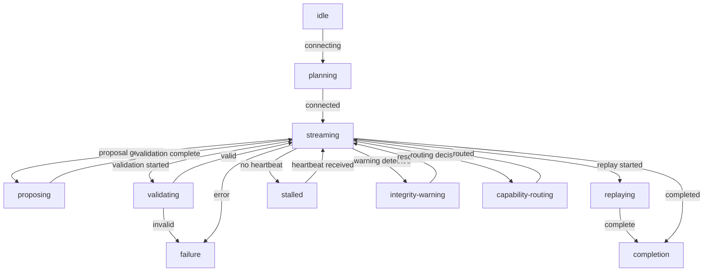

# Runtime Instrumentation Architecture

> **Phase 3: Truthful Runtime Instrumentation**
> Runtime Instrumentation & Truthful Animation Doctrine

---

## Table of Contents

1. [Overview](#overview)
2. [Core Doctrine](#core-doctrine)
3. [Architecture Principles](#architecture-principles)
4. [State Model](#state-model)
5. [Animation & Motion Doctrine](#animation--motion-doctrine)
6. [Component Architecture](#component-architecture)
7. [Data Flow](#data-flow)
8. [API Contract](#api-contract)
9. [Anti-Patterns](#anti-patterns)
10. [Validation & Testing](#validation--testing)
11. [Design Inspirations](#design-inspirations)

---

## Overview

This document describes the architecture and doctrine for **Phase 3: Truthful Runtime Instrumentation** of the Rig Runtime & Agent Execution Plane.

The frontend evolves from a chat UI into a **governed execution instrumentation surface** that faithfully represents real backend/runtime state.

### Key Transformation

| Before (Chat Era) | After (Instrumentation Era) |
|-------------------|---------------------------|
| Generic AI gradients | Geometric, operational instrumentation |
| Fake typing bubbles | Truthful stream velocity |
| Decorative particle systems | Deterministic state visualization |
| Uncontrolled CSS chaos | Bounded, systematic styling |
| Canvas-heavy effects | Text-based, accessible rendering |
| Hidden frontend state | Projection-only, transparent state |

### Vision Statement

> ** Animations must derive from REAL backend/runtime state. **
> <br>
> Every pixel of motion, every color transition, every state indicator must be traceable to a deterministic, observable runtime event.

---

## Core Doctrine

### The Four Pillars

1. ** TRUTHFUL **: All visualizations derive from real, observable runtime state
2. ** DETERMINISTIC **: Same backend state = same visualization (replay-safe)
3. ** BOUNDED **: All buffers, states, and visualizations have explicit size limits
4. ** PROJECTION-ONLY **: Frontend consumes only projections, never raw subprocess state

### Non-Negotiable Invariant

> ** Animations derive ONLY from websocket events, projection state, sequence progression, runtime throughput, or replay state. **
> <br>
> NO timers, NO fake motion, NO synthetic activity.

### Authority Principle

- ** Backend is the source of truth **: All state originates from runtime events
- ** Frontend is a faithful mirror **: UI reflects, never infers or predicts
- ** Receipts are authoritative **: Only receipts become authoritative evidence; everything else is advisory

---

## Architecture Principles

### Separation of Concerns

```
┌─────────────────────────────────────────────────────────────┐
│                        BACKEND                               │
│  ┌──────────────┐   ┌──────────────┐   ┌──────────────┐    │
│  │   Streams    │   │ Projections  │   │  Registry    │    │
│  │ ( Raw )      │──▶│ (Sanitized) │──▶│ (Authoritative│    │
│  └──────────────┘   └──────────────┘   │   Receipts)  │    │
│                                            └──────────────┘    │
└─────────────────────────────────────────────────────────────┘
                               │
                               │ WebSocket
                               │ (Normalized Events)
                               ▼
┌─────────────────────────────────────────────────────────────┐
│                        FRONTEND                              │
│  ┌──────────────┐   ┌──────────────┐   ┌──────────────┐    │
│  │Instrumentation│   │   Widgets    │   │   Rendering  │    │
│  │ (State Machine│───▶│ (Pure Render)│──▶│ (textContent│    │
│  └──────────────┘   └──────────────┘   │    Only)      │    │
│                                            └──────────────┘    │
└─────────────────────────────────────────────────────────────┘
```

### Design Constraints

| Constraint | Purpose |
|-----------|---------|
| No timers as authority | Prevents fake motion disconnected from runtime |
| No setInterval/setTimeout for state | State must derive from events |
| No CSS animations without state basis | Motion must be truthful |
| No canvas for core visualization | Ensures accessibility and determinism |
| No hidden frontend state | All state must be observable from projections |
| No authority inference | UI never assumes runtime intent |
| No direct backend mutation | Widgets never trigger actions |

---

## State Model

### Instrumentation State Categories

The `RuntimeInstrumentation` state machine tracks these mutually exclusive states:

| State | Description | Visual Metaphor |
|-------|-------------|----------------|
| `planning` | Pre-execution planning phase | Steady indicator |
| `streaming` | Active token/chunk streaming | Flowing/animated |
| `proposing` | Proposal generation active | Pulsing |
| `validating` | Validation in progress | Rotating |
| `replaying` | Replay visualization active | Scrolling/linear |
| `stalled` | Stream stalled (no heartbeat) | Dashed/dimmed |
| `integrity-warning` | Integrity issues detected | Warning color |
| `capability-routing` | Routing decision in progress | Branching indicator |
| `completion` | Stream completed successfully | Checkmark |
| `failure` | Stream failed | X mark |
| `idle` | No active streams | Minimal indicator |

### State Transitions



### Visual State Entry Structure

Each entry in the visual state buffer contains:

```typescript
{
  id: string;              // Deterministic ID
  sequence: number;        // Sequence number in stream
  state: string;           // State category
  severity: string;        // debug/info/warning/error/critical
  channel: string;         // assistant/user/tool/etc
  content: string;         // Truncated content
  byteCount: number;       // Content size in bytes
  tokenCount: number;      // Estimated token count
  data: object;            // Additional event data
  metadata: object;        // Metadata
  timestamp: number;       // When the entry was created
  motionType: string;     // Derived motion classification
  color: string            // Derived color based on severity
}
```

---

## Animation & Motion Doctrine

### Truthful Motion Principles

#### 1. Motion Must Have a Source

Every animation must be traceable to one or more of:
- A WebSocket stream event
- A projection state update
- A sequence progression
- A runtime throughput measurement
- A replay state change

#### 2. No Fake Activity Patterns

** FORBIDDEN: **
- Typing indicators that don't correspond to actual tokens
- Thinking bubbles that don't correspond to actual computation
- Shimmer effects that don't correspond to actual loading
- Loading spinners that don't correspond to actual I/O
- Progress bars that advance without actual progress

** ALLOWED: **
- Pulse animation when proposals are being generated
- Flow animation when chunks are being streamed
- Scroll animation when replaying historical frames
- Fade animation when state transitions occur

#### 3. Geometric Motion Language

| Runtime State | Motion Type | Geometric Form | Color |
|--------------|-------------|----------------|-------|
| Streaming | Flow | Horizontal bar | Info |
| Proposing | Pulse | Circle | Warning |
| Validating | Rotate | Triangle | Info |
| Replaying | Scroll | Line | Secondary |
| Stalled | None | Dashed rectangle | Warning |
| Integrity Warning | None | Exclamation | Warning/Error |
| Capability Routing | Branch | Tree | Info |
| Completion | Fade | Checkmark | Success |
| Failure | None | X | Error |

#### 4. Velocity-Based Motion Modulation

Stream velocity (bytes/second, tokens/second) directly modulates animation parameters:

```
Velocity → Animation Duration:  inverse relationship
Velocity → Animation Scale:    direct relationship
Velocity → Animation Opacity:  direct relationship
```

Higher velocity = faster, more pronounced animations.
Lower velocity = slower, more subtle animations.
Zero velocity = no animation.

#### 5. Stream Density Visualization

Visual density correlates with:
- Chunk count in buffer
- Throughput (bytes/second)
- Sequence progression rate

```
Density = f(ChunkCount, Velocity)
Density → Element Gap:      inverse relationship
Density → Element Opacity: direct relationship
```

More chunks + higher velocity = denser, more opaque visualization.

---

## Component Architecture

### runtime-instrumentation.js

The core instrumentation state machine module.

#### Exported Classes

| Class | Purpose |
|-------|---------|
| `RuntimeInstrumentation` | Main state machine |
| `VisualStateBuffer` | Bounded buffer for visual state entries |
| `VelocityTracker` | Tracks stream throughput |
| `ReplayFrameBuffer` | Bounded buffer for replay frames |
| `IntegrityWarningBuffer` | Tracks integrity warnings |
| `StatefulLoader` | Stateful loading indicators |
| `VisualStateEntry` | Single visual state entry |
| `ReplayFrame` | Single replay frame |
| `IntegrityWarning` | Single integrity warning |
| `VelocitySample` | Single throughput sample |
| `ExecutionLane` | Represents a single execution lane |

#### Exported Enums

| Enum | Values |
|------|--------|
| `RuntimeInstrumentationState` | planning, streaming, proposing, validating, replaying, stalled, integrity-warning, capability-routing, completion, failure, idle |
| `InstrumentationSeverity` | debug, info, warning, error, critical |
| `VisualizationChannel` | assistant, user, system, tool, proposal, diagnostic, status, heartbeat, warning, error, completion, meta |
| `MotionType` | none, pulse, stream, replay, stalled, complete, failure |

#### Exported Utilities

| Utility | Purpose |
|---------|---------|
| `MotionUtils` | Truthful motion calculations |
| `generateDeterministicId()` | Deterministic ID generation |
| `formatBytes()` | Format bytes to human-readable |
| `formatTokens()` | Format tokens with commas |
| `getColorForSeverity()` | Get color for severity level |
| `getMotionClassForState()` | Get motion class for state |
| `clamp()` | Clamp value between min/max |
| `lerp()` | Linear interpolation |

### runtime-execution-panel.js

The main execution visualization widget.

#### Components

| Component | Purpose |
|-----------|---------|
| `renderRuntimeExecutionPanel()` | Main widget renderer |
| `renderExecutionLane()` | Renders a single execution lane |
| `renderCapabilityRouting()` | Renders capability routing visualization |
| `renderExecutionHistory()` | Renders execution history timeline |
| `renderStateTransition()` | Renders state transition indicator |
| `renderSupervisionState()` | Renders supervision state indicator |

#### Rendering Features

- ** Execution Lanes **: Grid of execution contexts with state, capabilities, usage stats
- ** Capability Routing **: Visual display of runtime, capabilities, trust level
- ** Execution History **: Bounded timeline of visual state entries
- ** State Transition **: Current state with geometric icon and animation
- ** Statistics **: Chunk count, token count, bytes, duration

---

## Data Flow

### Event Flow

```
Runtime Stream Events
       │
       ▼
┌─────────────────┐
│ WebSocket      │──▶ Normalized Messages
│ Integration    │
└─────────────────┘
       │
       ▼
┌─────────────────┐
│ Projection     │──▶ RuntimeStreamProjection
│ Builder        │
└─────────────────┘
       │
       ▼
┌─────────────────┐
│ Runtime         │──▶ Updated State
│ Instrumentation │    Motion Params
│                 │    Visual Entries
└─────────────────┘
       │
       ▼
┌─────────────────┐
│ Widget          │──▶ Rendered DOM
│ Renderers       │
└─────────────────┘
       │
       ▼
   User View
```

### State Synchronization

All state changes flow in one direction: ** Backend → Frontend **

1. Runtime generates stream events
2. Events are normalized and sent via WebSocket
3. Frontend receives and converts to internal representation
4. Instrumentation state machine processes events
5. Widgets re-render based on updated state
6. Animations are triggered based on state changes

### Replay Flow

Replay leverages the same data flow, but with historical data:

```
Replay Request
       │
       ▼
┌─────────────────┐
│ Replay          │──▶ Historical Events
│ Infrastructure  │
└─────────────────┘
       │
       ▼
┌─────────────────┐
│ Runtime         │──▶ Replay Frames
│ Instrumentation │    (with isReconstructed flag)
└─────────────────┘
       │
       ▼
Widget Re-renders
with Replay State
```

---

## API Contract

### WebSocket Message Types

| Type | Payload | Purpose |
|------|---------|---------|
| `stream_chunk` | content, channel, sequence, byte_count, token_count | Token/chunk data |
| `stream_status` | status, previous_status, message, reason | Status change |
| `stream_projection` | projection_id, kind, content, truncated, channel, severity | Projection data |
| `stream_complete` | receipt_id, completion_reason, total_tokens, total_chunks | Completion |
| `stream_failure` | failure_category, message, error_details | Failure |
| `stream_heartbeat` | missed_count, interval_seconds | Heartbeat |
| `stream_warning` | warning_code, message, details | Warning |
| `stream_proposal` | proposal_id, proposal_kind, payload, capability_ids | Proposal |
| `stream_ack` | message_id, stream_id, sequence | Acknowledgement |

### RuntimeInstrumentation Interface

```typescript
interface RuntimeInstrumentation {
  // Identifiers
  id: string;
  streamId: string;
  invocationId: string;
  providerId: string;

  // Buffers
  visualStateBuffer: VisualStateBuffer;
  velocityTracker: VelocityTracker;
  replayFrameBuffer: ReplayFrameBuffer;
  integrityWarningBuffer: IntegrityWarningBuffer;

  // Current State
  currentState: RuntimeInstrumentationState;
  currentSeverity: InstrumentationSeverity;
  currentMotionType: MotionType;
  motionIntensity: number;

  // Statistics
  totalBytes: number;
  totalTokens: number;
  totalChunks: number;
  lastSequence: number;

  // Capability Routing
  currentRuntime: string | null;
  currentCapabilities: string[];
  currentTrustLevel: string | null;

  // Methods
  handleEvent(event: any): RuntimeInstrumentation;
  handleProjection(projection: any): RuntimeInstrumentation;
  handleWebSocketMessage(message: any): RuntimeInstrumentation;
  addReplayFrame(frame: any): RuntimeInstrumentation;
  setReplayPosition(position: number): RuntimeInstrumentation;
  addIntegrityWarning(warning: any): RuntimeInstrumentation;
  updateCapabilityRouting(routing: any): RuntimeInstrumentation;
  getMotionParams(): MotionParams;
  getStreamVelocity(): VelocityInfo;
  getStats(): StatsInfo;
  getReplayState(): ReplayState;
  getIntegrityState(): IntegrityState;
  getCapabilityRoutingState(): RoutingState;
  getStateSummary(): StateSummary;
  reset(options?: ResetOptions): RuntimeInstrumentation;
  toJSON(): any;
  static fromJSON(data: any): RuntimeInstrumentation;
}
```

### UI Projection Contract

All UI widgets receive data through projections. The projection contract guarantees:

1. ** Advisory-Only **: All projection data is advisory, never authoritative
2. ** Replay-Safe **: Same projections produce same UI when replayed
3. ** Bounded **: All projection content has size limits
4. ** Deterministic **: Projections are created deterministically from events
5. ** JSON-Serializable **: All projections can be serialized to JSON

```typescript
interface UIProjection {
  type: string;           // Widget type
  id: string;            // Projection ID
  data: object;          // Projection data
  actions: Array<{        // Advisory actions (never auto-executed)
    label: string;
    type: string;
    disabled: boolean;
    disabledReason?: string;
  }>;
}
```

---

## Anti-Patterns

### Forbidden Fake Activity Patterns

These patterns are ** explicitly forbidden ** and must never appear in the codebase:

#### 1. Fake Thinking Indicators

```javascript
// FORBIDDEN
function simulateThinking() {
  setInterval(() => {
    // Changes UI without any backend state
    setDotCount(dots => (dots + 1) % 4);
  }, 500);
}

// ALLOWED - derive from actual proposal state
function renderThinkingOnlyWhenProposing(proposing) {
  if (proposing) {
    return 'Proposing...';
  }
  return 'Ready';
}
```

#### 2. Meaningless Shimmer

```javascript
// FORBIDDEN
function fakeLoadingShimmer() {
  return (
    <div className="shimmer">
      <div className="shimmer-bar" />
      <div className="shimmer-bar" />
    </div>
  );
}

// ALLOWED - show actual content or explicit empty state
function renderContentOrEmpty(content) {
  if (content) return content;
  if (content === null) return 'Waiting for backend...';
  return 'No content available';
}
```

#### 3. Arbitrary Loading Loops

```javascript
// FORBIDDEN
function infiniteLoadingSpinner() {
  // Spins forever regardless of backend state
  return <Spinner animation="border" />;
}

// ALLOWED - loading based on actual pending state
function renderLoaderWhenPending(pending) {
  if (pending) {
    return <LoadingIndicator state="pending" />;
  }
  return null;
}
```

#### 4. Synthetic Motion Disconnected from Runtime State

```javascript
// FORBIDDEN
function fakeProgress() {
  const [progress, setProgress] = useState(0);
  useEffect(() => {
    const timer = setInterval(() => {
      setProgress(p => Math.min(p + 10, 100));
    }, 100);
    return () => clearInterval(timer);
  }, []);
  return <ProgressBar value={progress} />;
}

// ALLOWED - progress derived from actual backend data
function renderRealProgress(projection) {
  const progress = projection.current_tokens / projection.total_tokens * 100;
  return <ProgressBar value={progress} />;
}
```

#### 5. Authority Inference

```javascript
// FORBIDDEN
function inferAuthority() {
  // UI assumes it knows what the backend will do
  if (streamContains('git')) {
    return <Warning>This might commit to git!</Warning>;
  }
  return null;
}

// ALLOWED - display advisory evidence only
function renderAdvisoryEvidence(proposal) {
  if (proposal.blocked) {
    return <Advisory>Proposal was blocked: {proposal.reason}</Advisory>;
  }
  return null;
}
```

### Forbidden CSS Patterns

These CSS patterns are forbidden because they enable fake motion:

```css
/* FORBIDDEN - creates motion without state basis */
.thinking-bubbles {
  animation: bubble 1s infinite;
}

/* FORBIDDEN - decorative-only gradient animation */
.ai-gradient {
  background: linear-gradient(...);
  background-size: 200% 200%;
  animation: gradient 5s ease infinite;
}

/* ALLOWED - animation tied to state class */
.state-streaming .stream-indicator {
  animation: pulse 200ms ease-in-out infinite;
}

.state-idle .stream-indicator {
  animation: none;
}
```

---

## Validation & Testing

### Deterministic Rendering Checks

```python
def test_deterministic_rendering():
    # Same data should produce identical output
    data = {...}
    html1 = render_widget(data)
    html2 = render_widget(data)
    assert html1 == html2
```

### Replay-Safe Ordering Checks

```python
def test_replay_safe_ordering():
    # Events in same order should produce same state
    events = [event1, event2, event3]
    inst1 = RuntimeInstrumentation()
    for e in events:
        inst1.handleEvent(e)
    
    inst2 = RuntimeInstrumentation()
    for e in events:
        inst2.handleEvent(e)
    
    assert inst1.toJSON() == inst2.toJSON()
```

### Bounded Buffer Checks

```python
def test_bounded_buffers():
    buffer = VisualStateBuffer(maxEntries=100)
    for i in range(1000):
        buffer = buffer.add(VisualStateEntry(sequence=i, ...))
    assert len(buffer.entries) <= 100
```

### Integrity Visualization Checks

```python
def test_integrity_visualization():
    inst = RuntimeInstrumentation()
    inst.addIntegrityWarning(IntegrityWarning(code='STALE_RECEIPT', ...))
    state = inst.getIntegrityState()
    assert state.hasErrors == False
    assert state.warningCount == 1
```

### Capability Routing Visualization Checks

```python
def test_capability_routing_visualization():
    inst = RuntimeInstrumentation()
    inst.updateCapabilityRouting({
        runtime: 'local',
        capabilities: ['file:read', 'file:write'],
        trustLevel: 'high'
    })
    routing = inst.getCapabilityRoutingState()
    assert routing.runtime == 'local'
    assert len(routing.capabilities) == 2
```

### Stalled Runtime Handling Checks

```python
def test_stalled_runtime():
    inst = RuntimeInstrumentation()
    # Simulate heartbeats stopping
    inst.handleEvent({ kind: 'heartbeat', missed_count: 3 })
    # After threshold, state should change
    assert inst.currentState == RuntimeInstrumentationState.STALLED
```

---

## Design Inspirations

### IBM Systems Manuals (1960s-1980s)

- Clean, functional typography
- High information density
- Status lights and indicators
- Geometric clarity

### Braun Instrumentation Design (Dieter Rams)

- "Less, but better"
- Honest materials and functions
- Clear visual hierarchy
- No decorative elements

### Bauhaus Geometric Hierarchy

- Primary shapes (square, circle, triangle) for different states
- Color as information, not decoration
- Grid-based layouts
- Functional aesthetics

### Terminal-Era Operational Panels

- Monospace typography
- High contrast for readability
- Keyboard navigable
- Status at a glance

### Control Room Visualization Systems

- Real-time data display
- Alarm/warning hierarchies
- Operators trust the display
- Life-critical reliability

---

## Migration Guide

### From Chat UI to Instrumentation UI

| Old Pattern | New Pattern |
|-------------|--------------|
| `<ChatMessage role="assistant">` | `<VisualStateEntry state="streaming">` |
| `<TypingIndicator />` | `<StateTransition state="proposing">` |
| `<LoadingSpinner />` | `<StatefulLoader progress={realProgress}>` |
| `<ProgressBar estimated />` | `<ProgressBar actual={projection.progress}>` |
| `useEffect(loadData, [])` | Projection-only rendering |
| `setInterval` animation | State-derived animation |

### Widget Normalization

All runtime widgets should be normalized to:

1. Accept projection data only
2. Never fetch data directly
3. Render deterministically
4. Use textContent, not innerHTML
5. Follow instrumentation hierarchy
6. Use consistent typography and spacing
7. Include advisory notices
8. Support replay visualization

---

## Conclusion

The Truthful Runtime Instrumentation architecture represents a fundamental shift in how Rig presents runtime activity to users. By grounding every visualization, animation, and state indicator in real, observable backend state, we create a system that is:

- ** Truthful **: Users can trust what they see
- ** Deterministic **: Same inputs produce same outputs
- ** Accountable **: Every UI element traces to backend state
- ** Operational **: Built for control room environments
- ** Accessible **: No canvas, no hidden state, text-based

This is not just a UI change—it's a ** philosophical commitment ** to honest, transparent, and reliable runtime visualization.

> "The UI should be a faithful servant of the backend state, never its master, never its interpreter."

---

## Document Metadata

| Field | Value |
|-------|-------|
| Version | 1.0.0 |
| Phase | 3 (Runtime Instrumentation) |
| Created | 2025-01-XX |
| Author | Rig Architecture Team |
| Status | Draft |
