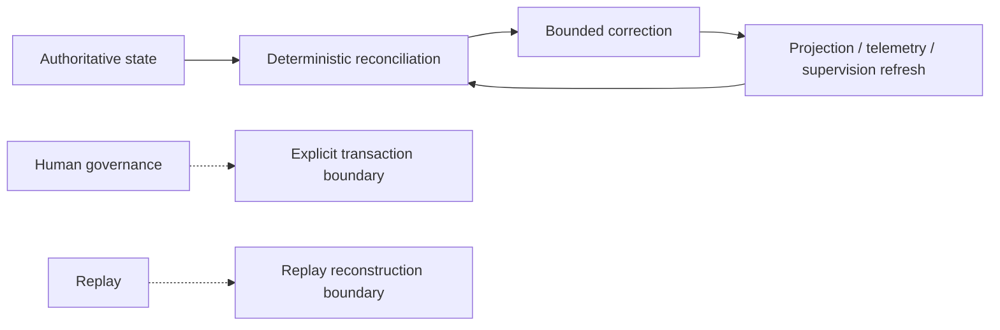
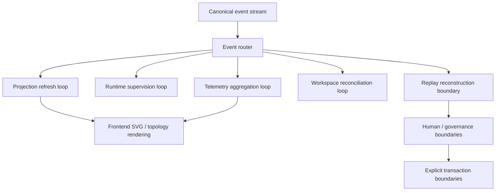

# Runtime Reconciliation & Operational Loop Convergence Audit

This audit classifies Rig runtime surfaces by whether they should operate as deterministic reconciliation loops, projection refresh cycles, continuous supervision loops, or explicit transactional boundaries. It does not propose replacing the current architecture; it only identifies where bounded reconciliation is safe and where authority must remain explicit.

## Definitions

| Category | Meaning |
|---|---|
| Reconciliation Loop Candidate | Should become a continuous operational loop |
| Projection Refresh Loop | Projection convergence cycle |
| Runtime Supervision Loop | Continuous runtime governance |
| Telemetry Aggregation Loop | Continuous operational synthesis |
| Explicit Transaction Boundary | Must remain transactional |
| Human Governance Boundary | Must remain human-authoritative |
| Replay Reconstruction Boundary | Deterministic replay-only |
| Legacy Imperative Flow | Drift-risk migration candidate |
| Dangerous Loop Candidate | Would introduce instability or authority ambiguity |

## Runtime Loop Candidates

## Phase 1: Runtime Domains

| Runtime Surface | State Authoritative? | Reconciliation Deterministic? | Replay Safety Achievable? | Drift Correction Continuous or Transactional? | Bounded Convergence? | Would a Loop Simplify or Destabilize? | Authority Human or Operational? |
|---|---|---|---|---|---|---|---|
| Runtime supervision | Operational, not authoritative | Yes, mostly | Yes | Continuous | Yes | Simplify if bounded | Operational |
| Runtime stream models | Operational evidence only | Yes | Yes | Continuous | Yes | Simplify if kept advisory | Operational |
| Runtime websocket transport | No | Yes after envelope normalization | Yes | Continuous | Yes | Simplify if normalized | Operational |
| Replay systems | Replay-only authoritative reconstruction | Yes | Yes | Transactional/replay-only | Yes | Simplify if loop means revalidation, not mutation | Operational via replay rules |
| Topology systems | Projection authority only | Yes | Yes | Continuous | Yes | Simplify if driven by canonical events | Operational |
| Telemetry systems | Derived operational evidence | Yes | Yes | Continuous | Yes | Simplify if aggregation stays bounded | Operational |
| Projection pipelines | Projection authority only | Yes | Yes | Continuous | Yes | Simplify | Operational |
| Workspace lifecycle | Mixed authoritative + operational | Partially | Yes | Mostly transactional | Partial | Loop risks boundary blur | Mixed |
| CI / governance integration | Human-governed transition path | Partially | Yes | Transactional | Partial | Destabilize if looped | Human |
| Frontend instrumentation | Projection-only | Yes after normalization | Yes | Continuous | Yes | Simplify if event-triggered | Operational |
| Artifact routing | Mixed | Partially | Yes | Mostly transactional | Partial | Loop only for cleanup/consistency | Mixed |
| Runtime isolation | Operational partitioning | Yes | Yes | Continuous | Yes | Simplify if namespace-driven | Operational |
| Replay namespace management | Operational partitioning | Yes | Yes | Continuous | Yes | Simplify if deterministic | Operational |

## Phase 2: Loop Candidate Classification

| Runtime Surface | Current Shape | Recommended Shape | Loop Candidate? | Replay Safe? | Authority Boundary? | Risk Level |
|---|---|---|---|---|---|---|
| Runtime supervision | Bounded async supervision with explicit decisions | Runtime supervision loop | Yes | Yes | Operational boundary | Medium |
| Telemetry aggregation | Backend-normalized samples | Telemetry aggregation loop | Yes | Yes, if normalized upstream | Operational boundary | Medium |
| Topology density convergence | Deterministic SVG/state rendering | Projection refresh loop | Yes | Yes | Operational boundary | Medium |
| Replay checkpointing | Receipt/audit reconstruction | Replay reconstruction boundary | No | Yes | Explicit transactional boundary | Low |
| Workspace health | Namespace and lifecycle checks | Reconciliation loop for cleanup and drift detection | Yes | Yes | Operational boundary | Medium |
| Runtime saturation monitoring | Threshold-based status derivation | Telemetry aggregation loop | Yes | Yes | Operational boundary | Medium |
| WebSocket transport normalization | Envelope + progress-event bridge | Projection refresh loop with canonical envelope adoption | Yes | Yes, if envelope-first | Operational boundary | Medium |
| SVG projection refresh | Stateful rendering from normalized inputs | Projection refresh loop | Yes | Yes | Operational boundary | Low |
| Governance merge approval | Human-controlled approval | Explicit transaction boundary | No | Yes | Human governance boundary | High if looped |
| PR submission | Commit/branch lifecycle action | Explicit transaction boundary | No | Yes | Human governance boundary | High if looped |
| Replay integrity verification | Deterministic validation | Replay reconstruction boundary | No | Yes | Explicit transactional boundary | Low |
| Topology snapshot export | Derived artifact emission | Explicit transaction boundary or scheduled export | No | Yes | Explicit transactional boundary | Medium |

### Loop Candidate Assessment

| Candidate | Decision | Reason |
|---|---|---|
| Runtime supervision loop | Accept | Supervisory drift can be continuously corrected without mutating authority |
| Telemetry aggregation loop | Accept | Aggregation is inherently derived and bounded |
| Projection refresh loop | Accept | Frontend and topology already depend on refresh semantics |
| Transport normalization loop | Accept with boundary discipline | Normalize payloads, but do not turn transport into authority |
| Workspace cleanup loop | Accept narrowly | Cleanup can be reconciled continuously if it only removes stale artifacts |
| Replay checkpoint reconciliation | Reject as continuous loop | Replay is reconstruction, not continuous mutation |
| Governance merge approval | Reject | Human authority must remain explicit |
| Explicit commits | Reject | Commit intent is a transaction boundary, not a loop |

## Phase 3: Event-Driven Reconciliation Readiness

| Substrate Capability | Ready for Reconciliation Loops? | Missing Preconditions |
|---|---|---|
| Canonical event routing | Yes | Wider adoption by all runtime surfaces |
| Replay ordering | Yes | Avoid dual replay semantics in legacy runtime paths |
| Projection rebuilding | Yes | Ensure all projections consume canonical envelopes |
| Telemetry normalization | Partially | Backend-agnostic schema propagation |
| Workspace isolation | Yes | Every artifact path must respect namespace partitioning |
| Topology convergence | Yes | Eliminate ad hoc payload assumptions |
| Runtime envelopes | Yes | Canonical envelope-first transport in all bridge paths |
| Transport normalization | Partially | Replace mixed JSON shapes in UI bridge |

### Readiness Summary

| Question | Answer |
|---|---|
| Does canonical state exist? | Yes |
| Are ordering guarantees sufficient? | Yes for core event flow |
| Are events immutable enough? | Yes for canonical runtime events |
| Is replay deterministic enough? | Yes for governance replay and event bridging |
| Are bounded buffers enforced? | Yes in the primary substrate |
| Is convergence measurable? | Yes |
| Is drift detectable? | Yes, but some legacy flows still need tighter routing |

## Phase 4: Transactional Boundaries

| Transactional Boundary | Why Loops Would Be Dangerous | Authority Ambiguity Introduced | Replay Guarantee Weakened |
|---|---|---|---|
| Merge approval | Approval must be explicit and human-owned | A loop would blur who authorized the merge | Replay would no longer distinguish decision from correction |
| Git commits | Commit is a discrete durable action | Automatic commit loops collapse intent and effect | Replay loses commit-point accountability |
| Replay integrity finalization | Finalization must close the replay record | A loop could keep rewriting the forensic result | Integrity evidence becomes unstable |
| Artifact publication | Publication is an externally visible release boundary | A loop could publish partial or stale artifacts | Replay cannot guarantee published state stayed fixed |
| Schema migration | Migration is a controlled transition | A loop could apply incompatible schemas repeatedly | Replay of old records may break |
| Governance escalation | Escalation must remain explicit | A loop could auto-escalate without review | Human authority collapses |
| Forensic snapshotting | Snapshot must freeze a point in time | Continuous snapshot loops destroy point-in-time meaning | Auditability weakens |

## Phase 5: Frontend Loop Pressure

| Frontend System | Implicit Loop? | Should Canonicalize? | Risk of UI Instability |
|---|---|---|---|
| SVG instrumentation | Yes, refreshes from state changes | Yes | Medium if fed non-canonical inputs |
| Topology refresh | Yes | Yes | Medium |
| Density collapse | Yes, threshold-driven | Yes | Medium |
| Throughput rendering | Yes | Yes | Medium |
| Replay visualization | Yes | Yes | Low-Medium |
| Motion governance | Yes | Yes, but remain bounded | Medium |
| Progressive disclosure | Yes | Partially | Low-Medium |

### Frontend Loop Interpretation

| Finding | Assessment |
|---|---|
| Which systems already behave like loops? | SVG instrumentation, topology refresh, density collapse, throughput rendering |
| Which loops are implicit? | Motion governance and progressive disclosure |
| Which loops should become canonicalized? | Projection refresh and canonical envelope normalization |
| Which loops threaten cognitive overload? | High-frequency density collapse and overly animated replay/projection transitions |
| Which loops should remain event-triggered instead? | Human-facing approvals, explicit transaction actions, forensic export boundaries |

## Phase 6: Workspace Reconciliation

| Workspace Concern | Reconciliation Candidate? | Why / Why Not | Risk |
|---|---|---|---|
| `.rig/worktrees/` lifecycle | Yes | Namespace management can be deterministically reconciled | Medium |
| Workspace metadata | Yes | It is derivable and bounded | Low-Medium |
| Runtime isolation | Yes | Partitioning is operational, not human-authoritative | Medium |
| Artifact routing | Narrowly | Cleanup and consistency checks fit loops; publication does not | Medium |
| Replay namespace cleanup | Yes | Deterministic cleanup of stale namespace state is safe | Medium |
| Temp-state lifecycle | Yes, narrowly | Remove stale temp artifacts; do not infer authority | Medium |

### Workspace Loop Types

| Loop Type | Recommendation | Notes |
|---|---|---|
| Cleanup loops | Accept | Safe if restricted to stale artifact removal and namespace hygiene |
| Namespace integrity loops | Accept | Good candidate for periodic reconciliation |
| Runtime health loops | Accept | Monitor isolation and drift continuously |
| Cross-lane loops | Reject | Would blur partition boundaries and create contamination risk |

## Phase 7: Telemetry & Saturation Loops

| Telemetry Surface | Should Reconcile Continuously? | Why | Drift Risk |
|---|---|---|---|
| Throughput telemetry | Yes | Derived operational signal should stay current | Medium |
| Batching pressure | Yes | Needs continuous adaptation to stay bounded | Medium |
| Runtime saturation | Yes | Overload correction is operational, not transactional | Medium |
| Topology density | Yes | Visual convergence depends on continuous synthesis | Medium |
| Memory pressure | Yes | Loop can preempt overload | Medium |
| Queue depth | Yes | Continuous correction prevents backlog drift | Medium |
| Replay velocity | Partially | Reconcile for display and integrity, not authority | Low-Medium |
| Stream cadence | Yes | Stable cadence is a bounded operational goal | Medium |

### Telemetry Loop Patterns

| Pattern | Recommendation | Reason |
|---|---|---|
| Overload collapse loops | Accept narrowly | Reduce presentation and processing pressure deterministically |
| Density convergence loops | Accept | Already aligned with topology rendering |
| Cadence stabilization loops | Accept | Useful for bounded operational smoothness |
| Runtime cooling loops | Accept with thresholds | Can reduce saturation safely if thresholded |
| Dangerous oscillation loops | Reject | Feedback loops without damping create instability |

## Replay-Safe Loop Patterns

| Pattern | Safe? | Why |
|---|---|---|
| Event-sorted projection refresh | Yes | Deterministic and bounded |
| Replay-derived integrity checks | Yes | Read-only and repeatable |
| Namespace cleanup from replay evidence | Yes | Removes stale state without altering authority |
| Telemetry aggregation from canonical events | Yes | Derived from immutable inputs |
| UI refresh from canonical envelopes | Yes | Presentation-only loop |

## Dangerous Loop Patterns

| Pattern | Why Dangerous | Risk |
|---|---|---|
| Everything becomes reactive | Collapses transactional and human boundaries | Authority ambiguity |
| Infinite event recursion | Unbounded self-triggering | Instability and event storms |
| Auto-approval loops | Human governance becomes implicit | Governance bypass |
| Auto-commit loops | Durable actions become unattended | Commit integrity loss |
| Replay-in-place mutation loops | Forensic history stops being forensic | Replay integrity loss |
| Cross-lane reconciliation loops | Namespace boundaries blur | Contamination and drift |
| Transport-as-authority loops | Message delivery becomes state authority | Semantic collapse |

## Reconciliation Topology

## Event-Driven Operational Synchronization

| Sync Path | Recommended Mode | Notes |
|---|---|---|
| Canonical event routing | Continuous | Core substrate primitive |
| Replay ordering | Boundary-triggered | Reconstruction only |
| Projection rebuilding | Continuous | Safe refresh loop |
| Telemetry normalization | Continuous | Derived synthesis loop |
| Workspace isolation | Continuous | Namespace hygiene loop |
| Topology convergence | Continuous | Should track canonical events |
| Runtime envelopes | Continuous | Normalize at transport edges |
| Transport normalization | Continuous | But not authority-bearing |

## Migration Priorities

| Priority | Work Item | Why |
|---|---|---|
| 1 | Runtime supervision reconciliation | Best candidate for bounded operational loops with clear authority |
| 2 | Telemetry aggregation loops | Improves drift detection and saturation control |
| 3 | Projection refresh convergence | Frontend already assumes refresh semantics |
| 4 | Transport normalization loops | Removes mixed message shapes and reduces drift |
| 5 | Workspace cleanup loops | Keeps namespaces and temp-state bounded |
| 6 | Replay checkpoint reconciliation | Narrowly for verification, not mutation |
| 7 | Topology density convergence | Operational readability under load |

## Operational Stability Risks

| Risk | Impact | Notes |
|---|---|---|
| Authority collapse | High | Continuous loops could replace explicit decisions if boundaries are blurred |
| Oscillation | High | Feedback without damping can create state churn |
| Replay-integrity erosion | High | Mutation loops around replay destroy forensic value |
| Topology instability | Medium-High | Excessive refresh or density collapse can overload the UI |
| Workspace contamination | Medium-High | Cross-lane loops can leak state across namespaces |
| Transport drift | Medium | Mixed envelope shapes can fragment operational semantics |

## Operational Assessment

| Question | Answer |
|---|---|
| Has Rig established the prerequisites for operational reconciliation loops? | Yes |
| Has Rig identified safe reconciliation domains? | Yes |
| Has Rig preserved authoritative transactional boundaries? | Yes |
| Has Rig avoided governance ambiguity? | Mostly, with legacy bridge risk remaining |
| Has Rig identified dangerous reactive patterns? | Yes |
| Has Rig clarified operational synchronization strategy? | Yes |

## Final Classification Summary

| Category | Surfaces |
|---|---|
| Reconciliation Loop Candidate | Runtime supervision, telemetry aggregation, workspace cleanup, topology density convergence |
| Projection Refresh Loop | SVG instrumentation, topology refresh, throughput rendering, frontend projection rebuilding |
| Runtime Supervision Loop | Runtime supervision, runtime saturation monitoring |
| Telemetry Aggregation Loop | Throughput telemetry, batching pressure, queue depth, memory pressure |
| Explicit Transaction Boundary | Git commits, merge approval, artifact publication, schema migration |
| Human Governance Boundary | Merge approval, governance escalation, PR approval |
| Replay Reconstruction Boundary | Replay checkpoints, replay integrity finalization, forensic snapshots |
| Legacy Imperative Flow | Mixed websocket transport, legacy runtime stream state, ad hoc artifact routing |
| Dangerous Loop Candidate | Auto-approval, auto-commit, infinite recursion, cross-lane reconciliation |

## Validation Notes

- `python3.14 -m compileall -q src tests`
- `bash scripts/check.sh --fast`

